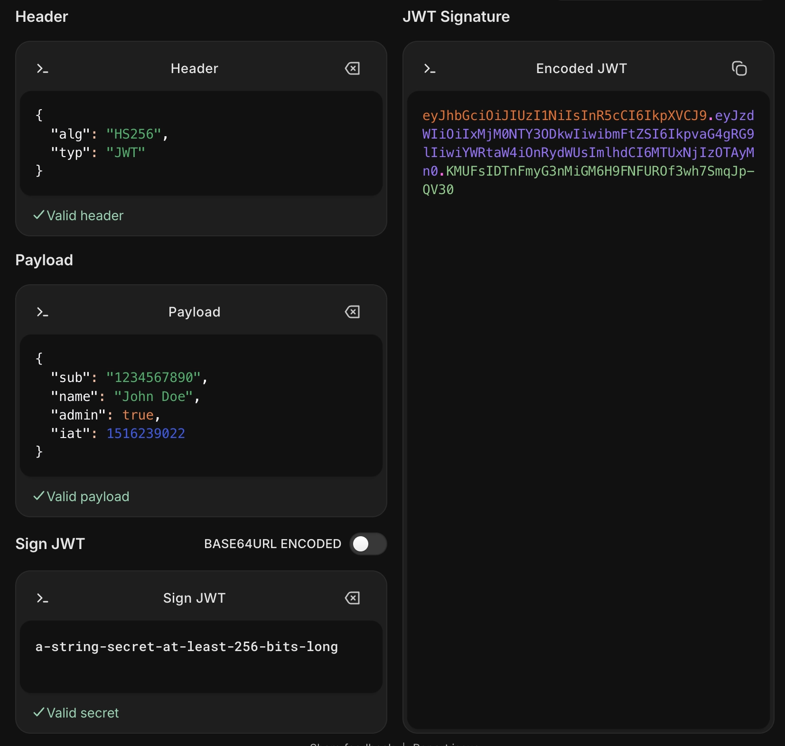
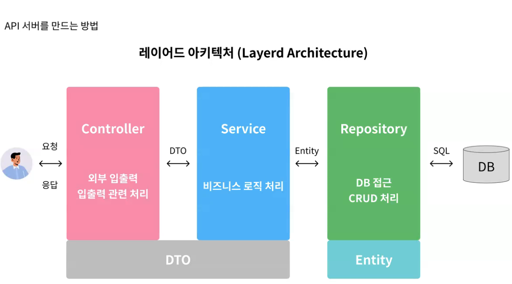

# TIL

## 날짜: 2026-05-27

# HTTP 자격 증명 헤더

- 클라이언트와 서버 간의 인증과정에서 사용자의 자격을 확인하기 위해 사용되는 헤더
- HTTP는 stateless 하므로 이전 요청에 대한 기억이 없으므로 접근 할 때마다 내가 누구인지 증명해야 한다.
- 이때 헤더를 통해서 인증하는 과정을 거친다.

### WWW-Authenticate

- 서버가 발급하는 Response Header
    - 요청이 인증이 필요한경우에 발급
    - 401 Unathorized 응답과 함께 반환

### Authorization

- 클라이언트 → 서버한테 요청할 때 보내는 헤더(Authorization 헤더)
- 본인 인지 확인할때 사용

# HTTP 인증 헤더 방식 3가지

## 1. Basic Authentication

- 기본 인증
- 아이디 + 패스워드 두 가지를 갖고 인증한다.
    - 해당 조합(charlie:password1234)을  Base64로 인코딩 한다.
    - 이때 인코딩은 암호화가 아닌것을 기억하자 (사실상 평문)

    ```java
    Authorization : Basic Aszxerf=
    ```

    ```java
    // 평문
    나는 찰리다
    
    // Base 64 인코딩
    64KY64qUIOywsOumrOuLpCDtgaztgaw=
    
    // 디코딩
    나는 찰리다
    ```

    - Basic 인증 방식은 항상 HTTPS TLS 방식의 암호화된 통신에서만 사용한다.
    - 이때 아이디, 패스워드는 서버에서 검증 해야한다.
        - 데이터베이스에 들어있는 id pw 조회하고 입력 값이랑 맞는지 확인하고 맞으면 인증 성공
        - 이 계정이 하려고하는 행위에 대한 권한이 있는지도 추가로 확인한다.
        - 즉, 서버 자원에 부담이 간다.
            - 중앙 집중식 서버에서 트래픽이 몰릴 때 만약 우리의 인증이 Basic 이라면, 여기가 병목 지점이 될 수 있다.
- 장점
    - 구현이 간단하다
    - 토이 프로젝트, 내부용 API 콜할 때 사용
        - ex. 내부 ERD 시스템
- 단점
    - 보안이 취약하다
        - 권한이 필요한 모든 요청마다 항상 “비밀번호”를 헤더에 담아서 보낸다.
        - TLS 암호화가 되어 있더라도, 한 번이라도 이 암호화가 풀린 구간에서 탈취당할 수 있다.

## 2. Digest Authentication

- basic 보다 더 안쓰여서 이런게 있다는 정도만 알자
- Basic의 보안 취약점을 해결하기 위해 등장
- 비밀번호를 직접 담아서 보내지말고, 차라리 해시 값으로 구워서 보내자
- Nonce, Realm
    - Nonce → 서버가 클라이언트한테 딱 한 번쓰고 버리라고 주는 일회성 난수
        - werwerkjlkefwl
    - Realm → 서버가 관리하는 보안 공간의 범위를 표기하는 문자열
        - users
        - posts
- 실행 과정
    1. 클라이언트가 보호된 리소스를 요청
    2. 서버 : 어 여기는 보호되어 있어. 내가 너한테만 주는 일회성 번호(Nonce), 공간 이름(Realm)을 줄테니까. 이거를 너의 비밀번호랑 함께 섞어서 해시 값으로 가져와(401 응답)
    3. 클라이언트 : 비밀번호 + Nonce, Realm을 해시 함수로 구워서 Authorization 헤더에 보낸다.
- 이렇게 해도 문제는 있다.
    - 비밀번호를 암호화 시키므로 보안성이 올라가긴한다.
    - 매번 요청마다 서버가 난수 만들고, 그거 기억하고, 요청오면 다시 해시화 해서 확인해보는건 유지되므로 서버 부담은 여전하다.

## 3. Bearer Token

- 기존 방식의 문제점을 해결하기 위해 등장
    - Basic → 비밀번호 매번 평문으로 보내기 + 매 요청마다 서버가 비번체크
    - Digest → 비밀번호 암호화 → 매 요청마다 서버가 체크 하는건 그대로

<aside>
💡

이 토큰을 소지한 요청은 “인증, 인가” 된걸로 한다.

</aside>

- 마치 “무기명 콘서트 티켓”

```java
Authorization : Bearer Bfdfdfc
```

- 왜 현대 웹에서 사용하냐?
    - 유저의 진짜 아이디 비번은 한 번만 전송된다.
        1. 최초 로그인 시도(body, id, pw)
        2. 서버에서 인증 과정을 수행하고
        3. 토큰을 발급한다.
        4. 토큰을 클라이언트한테 준다.
        5. 앞으로 클라이언트는 인증, 인가 필요할 때, 이 토큰을 함께 보낸다.
    - 이제부터 서버는 데이터베이스에 비밀번호 조회를 1번만 해도 된다.

### 베어러 토큰이란?

<aside>
💡

무기명 티켓

</aside>

- Bearer 의미 → 소지자, 운반인
    - 토큰을 들고 있는 사람은 정당한 권한이 있는걸로 간주한다.
    - 서버는 이 토큰을 내미는 사람이 진짜 철수 인지, 아니면 가짜 철수인지 상관하지 않는다.  토큰에 “철수”라고 적혀 있으면, 다 철수로 생각한다.
    - 티켓이 위조만 안되어 있으면 OK
- 영화관 티켓을 예시로 들면
    - 아이디 비번 매번인증하여 불편(기존 방식)
        - 영화관 입구에서 검표 대신, 아이디 비번 치고 들어가세요
    - 베어러 토큰 방식
        - 키오스크에서 티켓 받는다.
        - 티켓을 검표하는 분에게 보여주기만 하면 영화관을 들어간다.

### 베어러 토큰의 장점

1. 유저의 비밀번호가 보호된다.
2. 범용성이 좋다.
    - 과거 인증 방식(Session + Cookie)은 브라우저에서는 잘 작동하지만 모바일 앱에서는 동작하지 않는다.
    - 또한, 도메인이 달라지면, 쿠키가 따라 붙지 않는다. 즉, 인증이 깨지는 불편함이 존재
3. CSRF
    1. 님들이 토스 뱅크에서 이미지를 클릭했는데
    2. 사실은 토슈 뱅크
    3. 쿠키를 사용하면 이런 보안 취약점이 몇 가지 있는데, 이런 취약점들도 자연스럽게 방어되는 부분도 있다.

### 베어러 토큰의 단점

- 토큰은 무기명 티켓 → 내가 쓰든 남이쓰든 “찰리”라고만 적혀 있으면 다 “찰리”인줄 안다.
1. 토큰이 탈취당하면 위험하다.
    1. 토큰이 사실 탈취가 상당히 쉬움
    2. 왜냐하면 토큰은 관리하는 주체가 클라이언트이므로
    3. 토큰은 기본적으로
        1. HTTPS 에서 동작하는게 기본적인 원칙
        2. 토큰은 유효기간을 상당히 짧게 설정하는게 일반적이다(15m, 30m)
            1. 커뮤니티의 로그인 토큰 vs 은행의 로그인 토큰
                1. 토큰의 길이는 서비스마다 다른데,
                2. 서비스마다 지켜야하는 정보의 수준이 다르기 때문이다.
                3. 해커의 동기부여
2. 토큰은 보관하기가 까다롭다.
    1. 브라우저 → 자바스크립트로 Storage에 직접 접근할 수 있다.
    2. 브라우저의 저장공간은 크게보면 2개
        1. Storage ← 자바스크립트로 값을 가져올 수 있음
        2. Cookie  ← 항상 모든 요청에 쿠키가 자동으로 붙는다.
            1. [naver.com](http://naver.com) ← 받은 토큰을 쿠키에  저장
            2. [kakao.com](http://kakao.com) ← 여기에 요청을 보내도, 기본적으로 쿠키는 자동으로 날아간다.
                1. 쿠키 설정하면, 동일도메인만 쿠키 날아가도록 할 수 있긴 함
            3. 쿠키는 공간이 상당히 작다. ← 작은 텍스트 파일
    3. 스토리지에 보관 ← XSS 스크립트 해킹에 토큰 탈취
    4. 쿠키 ← CSRF 공격에 취약
        1.  CSRF 방어 하는 코딩을 하면 되는데, 근데 보통 이걸 까먹는다.

### 일반 베어러 토큰의 한계

`mF_9.B5f-4.1JqM`  ← 이런 토큰을 보여줬는데

- 이런 토큰을 오페이크 토큰, 불투명 토큰이라고 함
    - 토큰의 값이 의미가 없는 토큰
    - 무작위 문자열
- 서버에서는 이걸 보관해야한다.


| 유저id | 토큰값 |
| --- | --- |
| 10 | mf13 |
| 11 | md13 |
- 결국 이렇게 오페이크 토큰, 불투명 토큰을 사용하면, 서버가 부담해야하는 자원이 생긴다.
- 100만 명이다 → 오페이크 토큰을 조회하는 자원을 사용한다.

→ 서버가 DB를 안뒤져도, 토큰 글자 자체에 유저 정보가 적혀 있고, 정보가 위조됐는지 아닌지 까지 스스로가 증명할 수 있으면, 서버가 자원을 안써도 되겠는데?

→ JWT

# JWT(JSON Web Token)

- 토큰도 의미가 없으면 결국 기존 방식이랑 다를게 없네?

<aside>
💡

토큰 안에 회원 정보 들어 있고

위변조 여부까지 확인할 수 있는 토큰이라면

서버에서 굳이 DB 뒤져서 볼 필요 없지 않을까?

</aside>

## JWT 토큰이란

- 당사자 간에 정보를 JSON 객체 형태로 안전하고 가볍게 전송하기 위한 웹 표준 개방형 규격
- 마치 홀로그램 인쇄 티켓
    - 기존 토큰 → 아무 글자나 적힌 티켓 → 서버가 받으면, 아무 글자를 조회해서 이거 맞는지 확인하는 과정을 거쳐야 했다.
    - JWT 토큰은
        - [이름:박천명, 등급 : VIP, 만료일 : 내일]
        - [영화관장의 친필 홀로그램 사인]  서명 되어 있다.
        - 서버는 [사인] ← 이게  유효하다면, 내부 값은 위조 변조가 되지 않았구나라고 알 수 있다.


### JWT 토큰 구조 보기

```java
eyJhbGciOiJIUzI1NiIsIn... . eyJzdWIiOiIxMjM0NTY3O... . SflKxwRJSMeKKF2QT4fwpMe...
      [1. Header]        .       [2. Payload]       .       [3. Signature]
```



from [jwt.io](http://jwt.io)

- payload는 평문이라 서버, 클라이언트가 열어볼 수 있다.
- signature는 서버에서만 확인 할 수 있는 값
    - header+ payload + 서버 키 값을 합쳐서 해시화한다.
- jwt → 스스로 증명한다
    - header, payload는 볼 수 있지만 signature는 서버에서만 확인 할 수 잇다.

#### 헤더 영역

- 토큰의 타입, 서명에 사용된 알고리즘

```java
{
  "alg": "HS256",
  "typ": "JWT"
}
```

#### 페이로드 영역

- JWT 토큰에 담을 정보들이 있는 곳

```java
{
	"userId": 10,
  "email": "void@startupcode.kr",
  "username": "void",
	"role": "admin",
  "iat": 1609239023,
  "exp": 1609242623
}
```

- 그런데 여기는 평문 영역 → 인코딩, 디코딩 된 영역
- 노출되면 안되는 값은 넣으면 안된다.
    - 주민등록번호, 카드 번호, 비밀번호 등을 넣으면 안된다.
    - `iat` (Issued At)는 토큰이 발행된 시간
    - `exp` (Expiration Time)는 토큰의 만료 시간

#### 서명 영역

→ 이 토큰이 위조 되었나?를 검증하는 영역

- 인코딩 헤더(Base64) + 인코딩된 페이로드(Base 64) + 서버만 알고 있는 비밀 키 값
    - 이걸 하나로 합쳐서
    - 지정된 알고리즘으로 암호화한다.
    - 암호화 한다는 건 → 복호화 할 수 있다.
- JWT는 내부내용이 보이니까 내부 내용을 수정할 수 있는데
    - 해커가 페이로그 값을
    - name : charlie
    - name: void 로 변경하면
    - 시그니처가 달라진다.

## JWT는 왜 써야하나?

1. 완전한 무상태성 + 확장성
    - 불편했던 것
        - Basic, Digest 은 서버에서의 검증 로직이 존재
        - 서버가 데이터를 관리하고 조회하는 자원을 써야했다.
    - JWT 에서는 이미 내가 필요한 정보들, 인증, 인가 필요한  정보가 JWT 토큰에 작성되어 있다.
        - Base 64 디코딩하면 그 안에 있는 내용만 보면된다. → CPU 로 풀 수 있음
        - 암호화된 서명만 검증하면 된다.
    - 세션 늘리려고 레디스 안써도 된다.
    - 요청이 늘어나도 그냥 JWT 토큰 검증 시간만 든다.
2. DB 조회를 상당히 적게 한다.
    - 병목지점 → 왜냐면 데이터베이스를 조회하기 때문
        - 데이터베이스 조회가 왜 병목인가?
        - 데이터베이스는 가장 느린 쓰기 장치에 기록된다.
            - HDD ←
    - API 호출할 때 인증인가 필요할 때 다른 인증들은 DB 조회가 필요함

### 단점

1. 무효화가 어렵다
    - JWT 토큰이 발급되는 순간
        - 클라이언트가 들고 있다. → 스토리지, 쿠키
    - 해커가 JWT 토큰 탈취 → 만료 시키고 싶은데, 이걸 못한다.
    - 실무에서
        - Access Token, Refresh Token 사용
        - Access Token → 수명이 짧은 토큰
        - Refresh Token →  토큰을 재발급하는 토큰
2. 네트워크 대역폭이 낭비된다.
    - 토큰은 내부 내용이 많을 수록 길이가 길어진다.
    - 매번 API 요청할 때마다 수 키로바이트 짜리 Token을 매번 보내고, 왔다 갔다하고
    - 그만큼의 대역폭이 낭비된다.
    - 옵저빌리티
        - 유저 1명이 1분 동안 API 요청
        - 300~500개 API
            - 1KB → 500KB 네트워크 대역폭이 낭비
            - 동시 접속자가 만명
                - 500 x 10,000 = 5TB

## 실제 JWT 토큰 발급 방법

### 백엔드(스프링 기준)

```java
@Component
public class JwtProvider {
    // 운영 환경에서는 application.yml에 두고 환경변수로 주입
    private final String plainSecretKey = "Secretkk"; 
    private final long accessTokenValidityInMilliseconds = 1000 * 60 * 30; // 30분 유효기간

    private SecretKey getSigningKey() {
        // 평문 키를 암호학적으로 안전한 SecretKey 객체로 변환
        return Keys.hmacShaKeyFor(plainSecretKey.getBytes(StandardCharsets.UTF_8));
    }

    // JWT 큰을 발급 메서드
    public String createToken(String userId, String role) {
        Date now = new Date();
        Date validity = new Date(now.getTime() + accessTokenValidityInMilliseconds);

        return Jwts.builder()
                .header().add("typ", "JWT").and()            // 1. 헤더 설정
                .subject(userId)                             // 2. 페이로드: 유저 ID
                .claim("role", role)                         // 2. 페이로드: 유저 권한 (커스텀 클레임)
                .issuedAt(now)                               // 2. 페이로드: 발행 시간
                .expiration(validity)                        // 2. 페이로드: 만료 시간
                .signWith(getSigningKey(), Jwts.SIG.HS256)   // 3. 서명하기
                .compact();                                  // 4. 압축 후 String 변환
    }
}
```

### 클라이언트 코드

```java
// 1. 로그인 요청 후 서버로부터 JWT 토큰을 받아오는 함수
async function login(username, password) {
    const response = await fetch('https://api.charlie.com/v1/auth/token', {
        method: 'POST',
        headers: { 'Content-Type': 'application/json' },
        body: JSON.stringify({ username, password })
    });

    const data = await response.json();
    const jwtToken = data.accessToken; // 서버가 던져준 JWT

    // 임시로 브라우저 어딘가에 저장 (Access Token 저장 위치는 storage 로 사용)
    // 쿠키에 저장해도 괜찮
    localStorage.setItem('token', jwtToken);
}

// 2. 다음 API를 호출할 때 헤더에 토큰을 동봉하는 방법
async function fetchMyProfile() {
    const token = localStorage.getItem('token'); // 저장해둔 토큰 꺼내기

    const response = await fetch('https://api.charlie.com/v1/users/profile', {
        method: 'GET',
        headers: {
            // 'Bearer ' 뒤에 한 칸 띄우고 토큰을 그대로 붙임
            'Authorization': `Bearer ${token}`,
            'Content-Type': 'application/json'
        }
    });

    const profileData = await response.json();
    console.log("프로필 정보 조회 성공:", profileData);
}
```

# Access Token 과 Refresh Token

“엑세스 토큰의 수명을 15분으로 했다.” → 탈취당할 수 있으므로 → 토큰은 클라이언트가 관리하니까

15분마다 로그인이 튕기는 것이 문제 → 유저들이 불만족한다.

### 보안과 편의성의 딜레마

- 보안성을 높이면, 편의성 떨어짐
- 편의성 높이면, 보안성 떨어짐
- JWT 토큰은 서버가 상태를 들고 있지 않는다.
    - 한 번 발급되면 통제가 어렵다.
    - Access Token 수명을 2일로 늘리면?
        - 유저는 편한데, 중간 토큰 탈취당하면 2일동안 방법이 없다.
    - 수명을 줄이면
        - 해커가 훔쳐가도 15분 이면 만료되어서 보안성이 좋다. 유저는 15분마다 로그인을 다시 해야한다.

→ 유저가 인증하는건 Access Token

→ 토큰을 재발급하는걸 Refresh Token

- 놀이공원
    - 엑세는 토큰 → 놀이기구 탈때마다 보여주는 15분짜리 일회용 탑승권
        - 주머니에 넣고 다녀 탈취 가능성 높음
        - 15분뒤면 어차피 쓰레기가 된다. 그래서 주운사람도 얼마 몬쓴다.
    - 리프레시 토큰 → 가방 속에 있는 연간 회원권
        - 탑승권 만료되면, 이 회원권으로 다시 서버에 가서 “새 탑승권 주세요”

## 만약에 리프레시 토큰이 탈취 당하면?

- 엑세스토큰을 2주~1달 넘게 발급 받을 수 있다.
- 우리 서버는 리프레시 토큰의 주인이 진짜 주인인지, 해커인지 판단 할 수 없다.
- 이 문제를 해결하려고 하는 기술이 RTR이라고 한다.

## RTR(Refresh Token Rotation)

<aside>
💡

Refresh Token 재사용하지말고, 한 번 쓰면 폐기하고 다시 새걸로 바꾸자

</aside>

- 작동 시나리오
    1. 유저의 엑세스 토큰(A1) 만료
    2. 유저가 리프레시 토큰(R1)을 서버에 보내면서 엑세스 토큰 다시 만들어달라고 요청
    3. 서버는 본인의 저장소 (Redis) R1이 유효한지 확인한다. R1을 폐기한다.
    4. 서버는 유저한테 새로운 엑세스 토큰 A2 발급하고, + R2 도 발급한다.
    5. 서버는 R2를 저장소에 저장한다.


- 만약에 해커가 훔쳐도 상관없다.
- 해커가 탈취한 경우
    1. 해커가 훔친 R1 토큰으로 새 토큰 요청
    2. 서버는 R1 지운다. 해커한테 새 토큰세트 (A2, R2) 준다.
    3. R2를 저장소에 저장함
    4. 잠시 후, 진짜 유저가 자기가 들고 있던 R1 토큰으로 재발급 요청
    5. 저장소에서 R1을 검색 → 없네?
    6. R1으로 발급된 유저는 지금 비정상 유저다
        1. 해커가 쓴거 아님?
        2. 서버는 해당 유저아이디 관련된 모든 리프레시 토큰을 다 만료 시킨다. → 저장소에서 삭제 시킨다.
    7. 해커가 들고있던 R2가 의미가 없어진다.

```java
public TokenResponse refresh(String requestRefreshToken) {
    // 1. Redis에서 클라이언트가 제출한 Refresh Token 조회
    String userId = redisTemplate.opsForValue().get(requestRefreshToken);
    
    // RTR 검증하기. 
    // Redis에 토큰이 없다면, 이미 사용되었거나 위조된 토큰임
    if (userId == null) {
        // 해당 유저의 토큰을 전부다 무효화하기
        invalidateAllTokens(userId); // <- 이 메서드는 관련 토큰을 다 만료 시키는 것
        throw new SecurityException("Invalid Refresh Token");
    }

    // 2. [RTR] 사용한 현재 토큰은 Redis에서 지움
    redisTemplate.delete(requestRefreshToken);

    // 3. 새로운 토큰 커플(Access + Refresh)을 새로 생성함
    String newAccessToken = jwtProvider.createAccessToken(userId);
    String newRefreshToken = jwtProvider.createRefreshToken(userId);

    // 4. 새 Refresh Token을 Redis에 다시 등록
    redisTemplate.opsForValue().set(newRefreshToken, userId, 14, TimeUnit.DAYS);

    return new TokenResponse(newAccessToken, newRefreshToken);
}
```

# JWT를 더 안전하게 사용하는 방법

- 서버측에서 세션으로 관리하기
- JWT ← 클라이언트한테 모든 내용을 다 담아서 너가 들고 있어라
    - 서버의 제어권을 잃는다.

# 레이어드 아키텍처

- 관심사에 맞게 코드를 분리하기 위한 아키텍처
