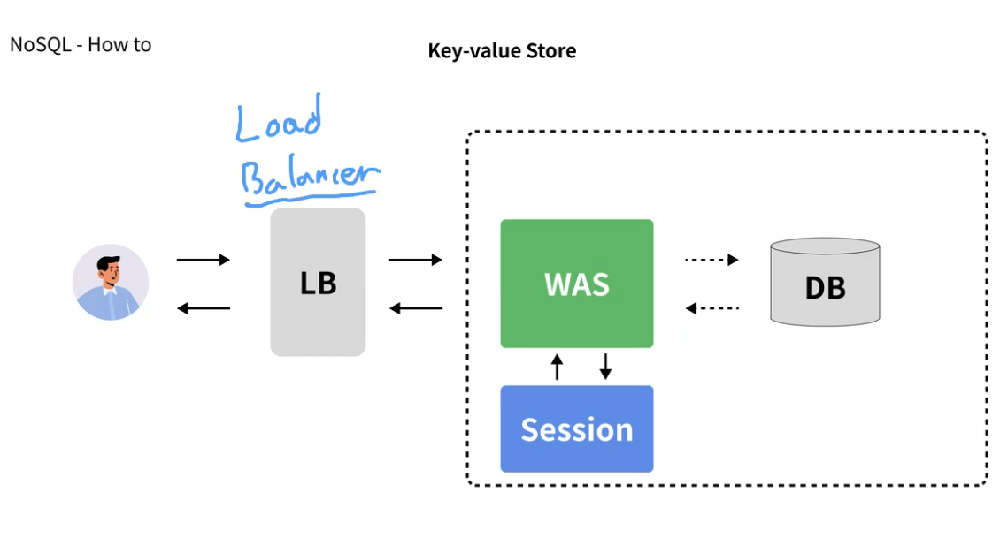
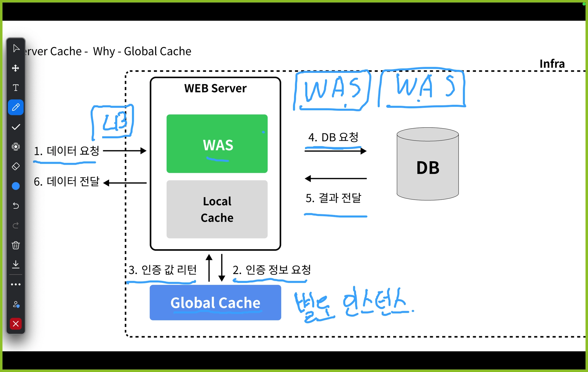

# TIL

## 날짜: 2026-05-28

# NoSQL, 서버 캐시

# NoSQL

- SQL 만을 사용하지 않는(비관계형) 데이터베이스
- 사용하는 이유
    - 다양한 데이터 유형을 유연하게 처리하고, 대규모 데이터를 효율적으로 관리하며, 시스템의 확장성과 성능을 극대화하므로

  | **이유** | **설명** |
      | --- | --- |
  | **데이터의 다양성** | - 구조적 데이터, 반구조적 데이터(JSON, XML), 비구조적 데이터(이미지, 동영상)를 유연하게 처리 가능
    - 고정된 스키마 없이 데이터 구조 변경에 유연해 다양한 애플리케이션 요구에 대응 가능 |
  | **대규모 데이터 처리** | - 분산 저장을 통해 병렬 데이터 처리 가능
    - 읽기/쓰기 작업 속도가 빠르며, 대규모 실시간 데이터 처리가 용이
    - 빅데이터 환경에서 필수적인 데이터 관리 솔루션으로 활용 |
      | **수평적 확장성** | - 저렴한 하드웨어를 활용해 서버를 추가하여 성능 및 용량을 확장 가능
    - 클라우드 환경에서 실시간으로 자원 확장 가능
    - 기존 RDBMS의 수직 확장 대비 비용 효율성이 높음 |
      | **유연한 설계 및 개발 속도** | - 초기 설계 단계에서 데이터 모델을 간단히 설정 가능하며, 변경 사항에 빠르게 적응 가능
    - 다양한 데이터 모델(키-값, 도큐먼트, 그래프, 컬럼 기반)을 지원해 특정 비즈니스 요구에 맞는 데이터베이스 선택 가능 |
    - 기존 RDB의 경우 유연하지 못하고 동시 처리성이 낮고 확장성이 낮은(수직 확장 의존) 문제가 존재

  ## 종류

  ### **키-값 저장소(Key-Value Stores)**

    - 각 키에 하나의 값이 매핑되는 가장 단순한 형태의 데이터 저장 방식
    - 단순한 key-value 쌍으로 데이터 저장
    - 장점
        - 매우 빠른 읽기/쓰기 속도
            - 인메모리 구조(모두 key-value는 아니지만 대부분)
            - 해시 테이블 기반(해시 인덱스처럼 동작)
        - 고가용성과 확장성
            - 구조 단순해서 수평 확장 용이
        - 강한 일관성
            - 인메모리는 최종 일관성, aerospike는 강한 일관성
        - 실시간성 + 데이터 연속성 + 큰 용량이 필요할 때 사용
    - 단점
        - 데이터 구조가 단순해서 복잡한 쿼리나 검색이 어려움
        - value 내부 구조를 DB가 이해하지 못한다.
    - 주 사용처
        - 세션 스토어, 캐시, 토큰, 사용자 설정(많이 써야하고, 많이 읽히는 곳)
    - 대표적인 예시로  Redis 가 있다.
    
    - RAM 전원을 끄면 데이터가 날아가는 이유
      → 캐퍼시터의 전하를 통해 데이터를 표현하므로 

  ### **문서 지향 데이터베이스(Document Oriented Databases)**

    JSON, XML과 같은 문서 형식을 사용하여(단위로) 데이터를 저장
    
    - 장점
        - 구조가 자유로워 스키마 변경이 유연
        - 문서 단위로 조회, 수정 가능
        - 쿼리 검색 유연
    - 단점
        - JOIN 이 어려워서 복잡한 관계 데이터 처리는 비효율적
        - 데이터의 중복을 허용
    - 주 사용처
        - 콘텐츠 관리, 블로그, 게시판, 카탈로그, 채팅시스템
        - 속성의 수정이 많거나, 관계성이 낮은 데이터
    - 대표적인 예시로 MongoDB, CouchDB(CouchBase = memcached +  CouchDB) 가 있다.

### **컬럼 기반 데이터베이스(Column-based Databases)**

컬럼 단위로 데이터를 저장하고 관리하여, 대량의 데이터를 빠르게 조회하고 분석할 수 있다.

테이블 구조처럼 컬럼 단위 데이터 저장, 동일 행 내 컬럼 그룹 관리

- 장점
    - 대용량 데이터, 빅데이터 처리 적합
    - 컬럼 단위 조회 최적화로 읽기 성능 좋음
- 단점
    - 설계가 복잡, 스키마 잘못 설계하면 비효율 발생
    - 단순 조회/저장 외 복합 쿼리는 어려움
- 주 사용처
    - 로그 수집, 분석, 시계열 데이터, 추천 시스템
    - 속성의 수정이 많거나, 관계성이 낮은 데이터
- 대표적인 예시로 Cassandra 가 있다.

### **그래프 데이터베이스(Graph Databases)**

데이터를 노드와 엣지로 표현하여, 객체 간의 관계를 중심으로 데이터를 저장하고 조회

- 장점
    - 관계 기반 조회 최적화
    - 소셜 네트워크, 추천 시스템에서 효율적
- 단점
    - 트랜잭션/대용량 처리 복잡
    - 수평 확장이 어려움(관계를 유지해야 하므로)
- 주 사용처
    - 소셜 그래프, 추천 엔진, 지식 그래프
- 대표적인 예시로 Neo4j 가 있다.

# 서버 캐시

- 웹 서버가 데이터를 빠르게 제공하기 위해 자주 사용되는 정보를 임시로 저장하는 장소

## 알아야 하는 이유

- 웹 사이트의 속도를 높이고 서버 부하를 줄여 사용자 경험을 개선할 수 있으므로

## 동작 방식

- 사용자의 요청에 대해 서버가 이미 처리한 결과를 저장해두고, 동일한 요청이 들어올 때 다시 계산하지 않고 저장된 결과를 바로 제공하여 처리 속도를 빠르게 하고 서버의 부하를 줄이는 방식으로 동작

### **로컬 캐시 (Local Cache)**

로컬 캐시는 한 서버 또는 서비스 인스턴스에 종속적인 캐시

이는 주로 단일 서버에서만 액세스되며, 서버가 관리하는 메모리 내에서 데이터를 저장

로컬 캐시는 해당 서버 내에서만 사용되고, 서버 간에는 공유되지 않음

로컬 캐시의 주요 장점은 접근 속도가 매우 빠르다는 것

하지만, 서버가 다수일 경우 각 서버의 캐시가 동기화되지 않기 때문에 일관성 유지가 어려울 수 있음

- **예시**
    - 한 웹 서버 인스턴스가 자주 요청받는 데이터를 메모리에 저장하여, 동일 서버 내의 후속 요청들이 빠르게 처리될 수 있게 함

### **글로벌 캐시 (Global Cache)**

글로벌 캐시는 여러 서버 또는 서비스 인스턴스 간에 공유될 수 있는 캐시

보통 별도의 캐시 서버나 캐시 계층을 사용하여 구현

데이터의 일관성 유지에 더 효과적이며, 서로 다른 서버에서도 동일하게 캐시된 데이터에 액세스할 수 있게 해줍니다. 이는 분산 환경에서 특히 유용

- **예시**
    - Redis, Memcached와 같은 분산 캐싱 시스템을 사용하여 여러 서버가 동일한 캐시 데이터에 액세스하고, 동기화된 정보를 유지할 수 있음

### **저장 위치**

- **로컬 캐시**
    - 보통 해당 서버의 RAM 내에 저장되며, 그 서버에서만 접근 가능
- **글로벌 캐시**
    - 외부 캐시 서버나 클라우드 기반의 캐시 서비스에 저장되어, 여러 서버나 애플리케이션에서 공유하여 사용할 수 있음

- 캐시의 경우 문제가 발생했을때 인지 시점이 느리다
    - 보통 사용자 report
- 따라서 안정적인 서비스와 옵저빌리티를 갖추는게 중요하다.
- 옵저빌리티

  프로그램의 실행, 모듈의 내부 상태, 구성 요소 간 통신에 관한 데이터를 수집, 분석하는 능력